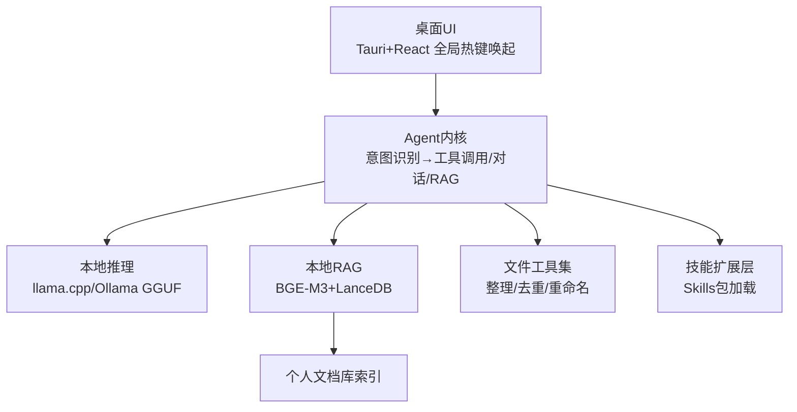

## 第一部分：选题填表

| **类别** | **编号** | **题目** | **限报** | **要求** | **需求概述** | **担任角色** | **建议方案** | **建议语言** | **成果形式** |
|:---:|:---:|:---|:---:|:---:|:---|:---|:---|:---:|:---|
| **2026年8月热点方向** | 34 | **端侧本地大模型个人AI助手** | 4 | | 本地大模型是2026年重要趋势：数据不出设备、零使用成本、毫秒级响应。构建一个完全离线运行的端侧个人AI助手：基于llama.cpp/Ollama运行Qwen3、DeepSeek蒸馏版等4bit量化模型，实现本地文件整理（自动分类、重命名、去重）、个人知识库问答（本地RAG）、会议纪要生成、代码辅助等Agent能力；提供跨平台桌面UI与全局热键唤起；支持Skills式技能扩展与本地向量索引；全程无云端依赖，隐私可控。对标“个人电脑成为个人AI助手运行平台”的产业方向。 | 架构师，后端，算法 | **推理引擎**：llama.cpp（GGUF量化）/ Ollama，Qwen3-4B/8B-Instruct、DeepSeek-R1-Distill量化版 **桌面端**：Tauri 2.x（Rust+Web前端，安装包<30MB）或Electron **本地RAG**：嵌入模型BGE-M3 + 本地向量库（sqlite-vec/LanceDB），支持PDF/Word/Markdown/Obsidian库 **Agent能力**：文件操作工具集 + 技能扩展机制（参考Agent Skills规范） **性能优化**：GPU offload、上下文缓存、流式输出 | Rust + TypeScript + Python | 系统、性能报告和部署文档 |

## 第二部分：完整设计方案与开发思路（4周版）

### 一、选题背景与价值定位

2026年本地AI受到空前关注：端侧模型能力逼近去年云端水平，4bit量化的8B模型已可在普通笔记本流畅运行；隐私合规与订阅成本推动“个人AI助手本地化”。本项目覆盖端侧推理优化、本地RAG、桌面应用开发三大实用技能，就业面覆盖AI应用、客户端与工具链开发。

### 二、系统架构设计

### 三、核心功能模块

1. **本地推理层**：llama.cpp/Ollama双后端，模型自动下载与量化档位选择（按显存/内存推荐）；流式输出与上下文管理。
2. **本地RAG知识库**：拖拽导入文档，自动分块嵌入建索引；问答带引用溯源（点击跳转到原文段落）；索引增量更新。
3. **文件整理Agent**：自然语言指令（“把下载文件夹里上个月的PDF按主题分类”）→扫描→计划预览→确认后执行→可撤销。
4. **桌面体验**：Tauri跨平台安装包、全局热键（Ctrl+Space）唤起、对话历史本地加密存储、深浅色主题。
5. **技能扩展**：遵循Agent Skills规范加载本地技能包，内置翻译、摘要、会议纪要、代码解释4个技能，支持用户自制。

### 四、开发路线图（4周）

| 阶段 | 任务 | 输出物 |
|:---|:---|:---|
| 第1周 | 推理层+流式对话UI；模型管理 | 可对话的桌面App |
| 第2周 | 本地RAG全链路（导入/索引/问答/溯源） | 知识库问答可用 |
| 第3周 | 文件整理Agent+撤销机制；技能加载器 | Agent能力成型 |
| 第4周 | 性能调优（首Token<2s）；安装包打磨；文档答辩 | 交付版v1.0 |

### 五、验证方案

- 离线验证：断网状态下全部功能可用（自动化测试脚本验证零外网请求）。
- 性能：8B量化模型在8GB内存轻薄本首Token延迟<3秒；10万字文档库问答检索<500ms。
- RAG质量：自建50题问答评测集，答案正确率≥85%且引用可溯源。

### 六、成果形式

- 跨平台安装包（Windows/macOS）+ 源代码（含中文注释）
- 性能报告（不同模型/量化档位对比）与部署使用文档
- 离线隐私合规说明
